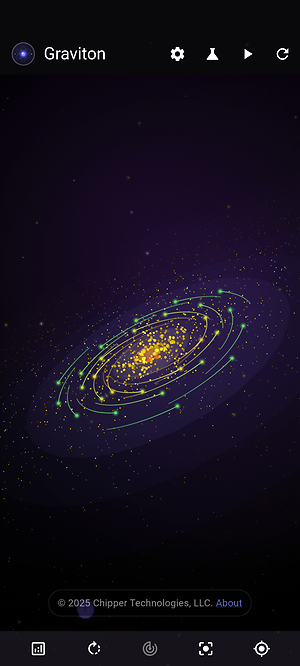
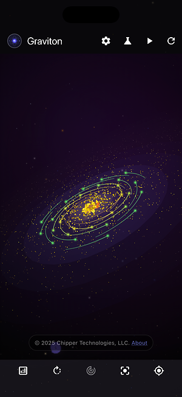
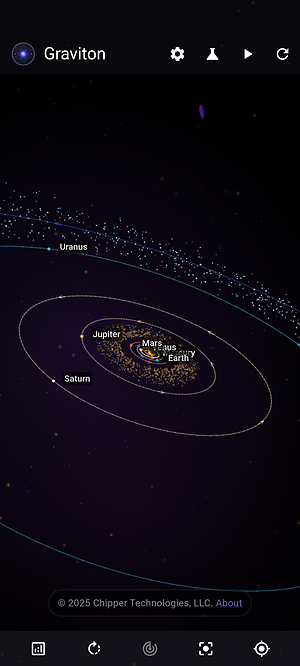
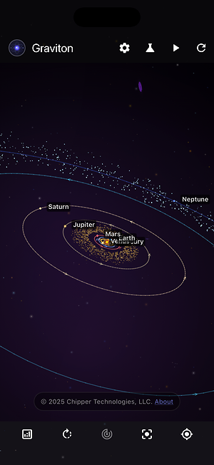
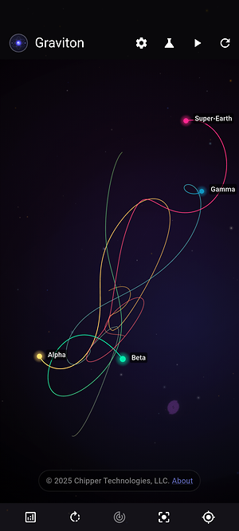

<div align="center">
  
  
  # Graviton
  ### Gravitational Physics Simulator
  
  <p align="center">
    <strong>A comprehensive Flutter application that simulates gravitational interactions between celestial bodies using advanced physics calculations, featuring realistic solar system dynamics, enhanced 3D visualization, and modern state management.</strong>
  </p>
  
  <p align="center">
    
    
    
    
  </p>
  
  <p align="center">
    
    
  </p>
  
  <p align="center">
    <a href="https://apps.apple.com/us/app/graviton-sim/id6754208416" target="_blank">
      
    </a>
    
  </p>
</div>

---

## 📚 Table of Contents

- [🎯 Features](#-features)
  - [🌌 Advanced Physics Simulation](#-advanced-physics-simulation)
  - [🪐 Realistic Solar System Features](#-realistic-solar-system-features)
  - [🎮 Enhanced Interactive Controls](#-enhanced-interactive-controls)
  - [📊 Real-time Statistics](#-real-time-statistics)
  - [🌍 Internationalization](#-internationalization)
  - [🔄 Smart Version Management](#-smart-version-management)
  - [📸 Screenshot Mode](#-screenshot-mode-development-feature)
- [🏗️ Technical Architecture](#️-technical-architecture)
- [🚀 Getting Started](#-getting-started)
  - [📋 Prerequisites](#-prerequisites)
  - [🛠️ Installation](#️-installation)
  - [📦 Dependencies](#-dependencies)
  - [🎯 Quick Start Guide](#-quick-start-guide)
  - [💻 VS Code Development Workflow](#-vs-code-development-workflow)
  - [🔨 Building for Production](#-building-for-production)
- [📱 Screenshots](#-screenshots)
- [🛠️ Development Tools](#️-development-tools)
  - [🚀 Fastlane Automation](#-fastlane-automation)
- [🏗️ Technical Architecture](#️-technical-architecture)
- [🔥 Firebase Integration](#-firebase-integration)
- [🔧 Troubleshooting](#-troubleshooting)
- [🤝 Contributing](#-contributing)
- [📄 License](#-license)

---

## 🎯 Features

### 🌌 Advanced Physics Simulation
- **Runge-Kutta 4th Order Integration**: High-precision numerical integration for accurate orbital mechanics
- **Multiple Scenarios**: Choose from various pre-configured scenarios:
  - **Solar System**: Complete solar system with realistic planetary features, rings, and moon orbits
  - **Earth-Moon-Sun**: Focused three-body system with accurate lunar mechanics
  - **Binary Star**: Dramatic binary star system dynamics
  - **Three Body Classic**: Traditional chaotic three-body problem
- **Real-time Collision Detection**: Bodies merge when they get too close, creating spectacular visual effects
- **Customizable Time Scale**: Speed up or slow down the simulation (0.1x to 16x speed)
- **Counterclockwise Orbital Motion**: Astronomically accurate orbital directions

### 🪐 Realistic Solar System Features
- **Accurate Planetary Representations**: Each planet rendered with distinctive colors and features
- **Beautiful Ring Systems**: 
  - **Saturn**: Realistic filled rings with proper proportions (1.11-2.32 planet radii)
  - **Uranus**: Narrow, inclined ring system with subtle glow effects
- **Moon Orbital Mechanics**: Visible Moon orbit around Earth with proper dynamics
- **Enhanced Planetary Sizing**: Realistic relative sizes and distances
- **Orbital Path Visualization**: Clear orbital trajectories with directional indicators

### 🎮 Enhanced Interactive Controls
- **Play/Pause**: Start and stop the simulation
- **Reset**: Generate new random initial conditions and restart the simulation
- **Advanced Camera Controls**: 
  - **Single finger drag**: Pan and rotate view (yaw/pitch)
  - **Two finger pinch/spread**: Zoom in/out 
  - **Two finger rotation**: Roll camera around viewing axis ✨ *NEW*
  - **Auto-rotation mode**: Smooth automatic camera rotation
  - **Enhanced center button**: Resets position, zoom, AND roll ✨ *NEW*
- **Trail Visualization**: 
  - Toggle orbital trails on/off
  - Choose between warm (🔥) and cool (❄️) color schemes
  - Enhanced trail rendering with proper opacity gradients

### 📊 Real-time Statistics
- Simulation steps counter
- Elapsed time
- Current speed multiplier
- Number of active bodies
- Simulation status (running/paused)
- Camera distance and auto-rotation status

### 🌍 Internationalization
The app supports multiple languages with automatic device language detection:

- **English** (en) - Default
- **Spanish** (es) - Español  
- **French** (fr) - Français
- **Chinese Simplified** (zh) - 简体中文
- **German** (de) - Deutsch
- **Japanese** (ja) - 日本語
- **Korean** (ko) - 한국어

All UI elements are fully localized, including:
- App title and navigation
- Control buttons and tooltips
- Status messages and statistics
- Trail mode labels
- Version management dialogs and status badges

### 🔄 Smart Version Management
Advanced dual-threshold version management system with Firebase Remote Config integration:

#### ⚡ **Automatic Update Checking**
- Real-time version status monitoring
- Firebase Remote Config integration for dynamic version control
- Semantic version comparison (supports major.minor.patch format)

#### 🎯 **Dual-Threshold Policy**
- **Enforced Updates**: Critical updates that cannot be dismissed
- **Preferred Updates**: Optional updates with "Later" dismissal option
- Flexible policy configuration without app store releases

#### 📱 **Smart User Experience**  
- Context-aware update dialogs
- Direct app store navigation (iOS App Store / Google Play Store)
- Visual status badges in About dialog
- Full localization in all 7 supported languages

#### 🏷️ **Version Status Indicators**
- 🟢 **Current**: Up-to-date with latest version
- 🔵 **Beta**: Pre-release/development builds
- 🔴 **Outdated**: Upgrade available but not required
- 🚫 **Enforced**: Mandatory update required
- 💡 **Preferred**: Optional update recommended

### 📸 Screenshot Mode (Development Feature)
Professional screenshot capture system for creating marketing materials:

#### 🚀 **How to Enable**
1. **Build in Development Mode**: Use the dev flavor to enable screenshot mode
   ```bash
   flutter run --flavor dev --target lib/main.dart
   ```
2. **Access Settings**: Open the app settings/menu 
3. **Find Screenshot Mode**: Look for the "Screenshot Mode" toggle (only visible in dev builds)
4. **Enable Feature**: Toggle on to activate preset scene controls

#### 🎮 **How to Use**
1. **Enable Screenshot Mode**: Toggle the switch in settings
2. **Select Scene**: Choose from 12+ predefined scenes in the dropdown
3. **Apply Scene**: Tap "Apply Scene" to activate (simulation pauses automatically)
4. **Take Screenshot**: Use your device's screenshot function
5. **Navigate Scenes**: Use Previous/Next buttons to cycle through presets
6. **Deactivate**: Tap "Deactivate" in the snackbar or disable screenshot mode

#### 🎬 **Preset Scene Management**
- **12+ Predefined Scenes**: Carefully crafted marketing screenshots
- **Dynamic Camera Positioning**: Optimal angles for each scenario
- **Scenario Integration**: Automatic simulation setup for perfect shots
- **One-Click Application**: Instant scene activation with simulation pause

####  **Professional Features**
- **Scene Preview**: Dropdown with descriptions for each preset
- **Quick Navigation**: Previous/Next buttons for rapid scene cycling
- **Status Indicators**: Visual feedback when scenes are active
- **Simulation Control**: Automatic pause for clean capture
- **Deactivation Options**: Easy return to normal simulation mode

#### 🔧 **Development Integration**
- **Flavor-Based Availability**: Only enabled in development builds
- **Clean Production Builds**: Completely hidden in release versions

> **Note**: Screenshot mode is only available when running with the `dev` flavor. It will not appear in production builds or when using the `prod` flavor.

---

## 🚀 Getting Started

### 📋 Prerequisites

- **Flutter SDK**: Version 3.0 or higher
- **Dart SDK**: Version 3.0 or higher  
- **IDE**: VS Code with Flutter extension (recommended) or Android Studio
- **Platforms**: iOS 11+, Android API 21+, or modern web browser

**For iOS Development:**
- **macOS**: Required for iOS builds and simulator testing
- **Xcode**: Latest version for iOS compilation
- **iOS Simulator**: Included with Xcode for testing

**For Android Development:**
- **Android Studio** or **Android SDK**: For emulator and device testing
- **Java/Kotlin**: Included with Android Studio

**Recommended VS Code Extensions:**
- Flutter (Dart-Code.flutter)
- Dart (Dart-Code.dart-code)
- GitLens (eamodio.gitlens)
- Error Lens (usernamehw.errorlens)

### 🛠️ Installation

1. **Clone the repository**
   ```bash
   git clone https://github.com/Chipper-Technologies/graviton.git
   cd graviton
   ```

2. **Install dependencies**
   ```bash
   flutter pub get
   ```

3. **Generate localization files**
   ```bash
   flutter gen-l10n
   ```

4. **Run the app**
   ```bash
   # Quick start with development configuration
   flutter run --dart-define-from-file config/dev.json --flavor dev
   
   # Production configuration  
   flutter run --dart-define-from-file config/prod.json --flavor prod
   
   # Web version (no flavor needed)
   flutter run -d chrome --dart-define-from-file config/dev.json
   
   # iOS version (no flavor needed)
   flutter run -d "iPhone 15" --dart-define-from-file config/dev.json
   ```

### 📦 Dependencies

The project uses the following key dependencies:

```yaml
dependencies:
  flutter:
    sdk: flutter
  flutter_localizations:    # Internationalization support
    sdk: flutter
  intl: any                  # Internationalization utilities
  cupertino_icons: ^1.0.8   # iOS-style icons
  provider: ^6.1.2          # State management
  vector_math: ^2.2.0       # 3D mathematics and transformations
  vibration: ^3.1.3         # Haptic feedback for interactions
  # Firebase dependencies
  firebase_core: ^4.2.0     # Firebase core functionality
  firebase_analytics: ^12.0.3 # Analytics and user behavior tracking
  firebase_crashlytics: ^5.0.3 # Crash reporting and monitoring
  firebase_remote_config: ^6.1.0 # Dynamic app configuration
  # Additional dependencies
  flutter_svg: ^2.2.1       # SVG rendering support
  package_info_plus: ^9.0.0 # Package information utilities
  shared_preferences: ^2.5.3 # Local data persistence
  url_launcher: ^6.3.1      # URL launching capabilities

dev_dependencies:
  flutter_test:
    sdk: flutter
  flutter_lints: ^6.0.0     # Dart/Flutter linting rules
  flutter_launcher_icons: ^0.14.4 # App icon generation
  flutter_native_splash: ^2.4.7   # Native splash screen generation
```

### 🎯 Quick Start Guide

1. **Launch the app** - Choose your preferred platform
2. **Select a scenario** - Start with "Solar System" for the full experience
3. **Explore controls**:
   - 🖱️ **Drag** to rotate the camera
   - 🤏 **Pinch** to zoom in/out
   - 🔄 **Two-finger rotate** for camera roll
   - ▶️ **Play/Pause** to control simulation
4. **Customize experience**:
   - ⚡ Adjust speed with the slider
   - 🌟 Toggle trails for orbital visualization
   - 📊 Enable stats for detailed information

### 💻 VS Code Development Workflow

Graviton includes comprehensive VS Code integration for streamlined development:

#### 🚀 Launch Configurations (F5 Debugging)

Access via the Debug panel or `F5` key:

- **Development [DEBUG]** - Full debugging with development config
- **Development [PROFILE]** - Profile mode for performance testing
- **Development [RELEASE]** - Release mode with development config
- **Production [RELEASE]** - Production configuration testing

*All configurations use `--dart-define-from-file` for cross-platform compatibility.*

#### 🔨 Build Tasks

Access via `Cmd/Ctrl + Shift + P` → "Tasks: Run Task":

**Development & Running:**
- 🚀 **Run Development** *(Default)* - Quick development testing
- 🎯 **Run Production** - Test with production configuration

**Android Builds:**
- 📱 **Build Android APK (Dev/Prod)** - Direct installation APKs
- 📦 **Build Android Bundle (Dev/Prod)** - Google Play Store bundles

**iOS Builds:**
- 🍎 **Build iOS (Dev/Prod)** - iOS app builds
- 📋 **Build iOS Archive (Dev/Prod)** - App Store IPA archives

**Maintenance:**
- 🧹 **Clean Build** - Clear Flutter cache
- 📦 **Get Dependencies** - Update packages
- 🔍 **Analyze Code** - Static analysis
- 🧪 **Run Tests** - Execute test suite

#### ⌨️ Quick Commands

- `F5` - Start debugging with selected configuration
- `Cmd/Ctrl + Shift + B` - Run default build task
- `Cmd/Ctrl + Shift + P` → "Flutter: Hot Reload" - Apply changes instantly
- `Cmd/Ctrl + Shift + P` → "Flutter: Select Device" - Choose target device

#### 📱 Cross-Platform Development

**Important Note:** iOS development uses `--dart-define-from-file` instead of traditional flavors for better compatibility. This ensures consistent behavior across all platforms.

### 🔨 Building for Production

Graviton supports multiple build targets for distribution. Choose the appropriate build method based on your needs.

#### 📱 Android Builds

**APK (Direct Installation)**
```bash
# Development build
flutter build apk --flavor dev --dart-define-from-file config/dev.json --release

# Production build  
flutter build apk --flavor prod --dart-define-from-file config/prod.json --release
```

**App Bundle (Google Play Store)**
```bash
# Development build
flutter build appbundle --flavor dev --dart-define-from-file config/dev.json --release

# Production build
flutter build appbundle --flavor prod --dart-define-from-file config/prod.json --release
```

#### 🍎 iOS Builds

**iOS App (Xcode)**
```bash
# Development build
flutter build ios --dart-define-from-file config/dev.json --release

# Production build
flutter build ios --dart-define-from-file config/prod.json --release
```

**IPA Archive (App Store)**
```bash
# Development build
flutter build ipa --dart-define-from-file config/dev.json --release

# Production build
flutter build ipa --dart-define-from-file config/prod.json --release
```

#### 🌐 Web Build

```bash
# Build for web deployment
flutter build web --dart-define-from-file config/prod.json --release
```

####  Build Outputs

- **Android APK**: `build/app/outputs/flutter-apk/`
- **Android App Bundle**: `build/app/outputs/bundle/`
- **iOS App**: `build/ios/iphoneos/Runner.app`
- **iOS IPA**: `build/ios/ipa/`
- **Web**: `build/web/`

#### ⚙️ Build Configuration

The app uses dart-define-from-file configuration system:

- **Development** (`config/dev.json`): Development settings and debug features
- **Production** (`config/prod.json`): Optimized release settings

Each configuration can have different:
- API endpoints
- Debug settings
- App identifiers
- Feature flags
- Screenshot mode availability (dev only)

#### � Android Release Signing Setup

For Google Play Store distribution, you need to set up release signing:

**1. Generate Release Keystore (Automated)**
```bash
# Run the included script to generate keystore and configure signing
tools/generate_keystore.sh
```

**2. Manual Keystore Generation**
```bash
# Create a release keystore manually
keytool -genkey -v -keystore android/upload-keystore.jks \
        -alias upload -keyalg RSA -keysize 2048 -validity 10000

# Then update android/key.properties with your credentials:
# storeFile=upload-keystore.jks
# storePassword=your_store_password
# keyAlias=upload  
# keyPassword=your_key_password
```

**3. Build Signed Release**
```bash
# After keystore setup, build your signed app bundle
flutter build appbundle --flavor prod --dart-define-from-file config/prod.json --release
```

**⚠️ Important Notes:**
- Keep your `upload-keystore.jks` file secure and backed up
- Never commit `android/key.properties` to version control (already in .gitignore)
- If you lose your keystore, you can't update your app on Google Play
- The same keystore must be used for all future app updates

#### �🔧 Build Troubleshooting

**Common Issues:**

- **"Debug mode" signing error**: Run `tools/generate_keystore.sh` to set up release signing
- **iOS builds fail**: Ensure you have Xcode installed and iOS development certificates configured
- **Android signing errors**: Verify your `android/key.properties` file is properly configured
- **Flavor errors**: Make sure flavor configurations exist in `android/app/build.gradle` and `ios/Runner.xcodeproj`
- **Missing dependencies**: Run `flutter clean && flutter pub get` before building
- **Out of memory**: Use `flutter build --split-debug-info=<output-dir>` for large builds

**Performance Optimization:**
- Use `--obfuscate` flag for production builds to reduce app size
- Enable R8/ProGuard for Android builds in release mode
- Consider using `--tree-shake-icons` to reduce icon bundle size

> **💡 Pro Tip:** For automated builds and deployment, check out our [Fastlane automation setup](docs/FASTLANE.md) which handles all the above commands with simple one-liners and includes automatic deployment to app stores.

---

## 📱 Screenshots

*Click any screenshot to view full size*

<div align="center">

| Preset Scene | Android | iOS |
|-------------|---------|-----|
| **Galaxy Formation Overview** | <a href="assets/screenshots/android/android-1.png" target="_blank"></a> | <a href="assets/screenshots/ios/ios-1.png" target="_blank"></a> |
| **Complete Solar System** | <a href="assets/screenshots/android/android-4.png" target="_blank"></a> | <a href="assets/screenshots/ios/ios-4.png" target="_blank"></a> |
| **Three-Body Ballet** | <a href="assets/screenshots/android/android-12.png" target="_blank"></a> | <a href="assets/screenshots/ios/ios-12.png" target="_blank"></a> |

</div>

### 📸 More Screenshots

**[View Complete Gallery →](docs/MARKETING.md)** - See all 12 preset scenes for both Android and iOS platforms

---

## 🛠️ Development Tools

The project includes several development tools to streamline the build and deployment process:

### 📸 Screenshot Processing
Process raw device screenshots into optimized images for documentation and app stores:

```bash
# Generate all screenshot variants
./tools/generate_screenshots.sh

# README thumbnails only
./tools/generate_screenshots.sh --readme-only

# App store feature images only  
./tools/generate_screenshots.sh --feature-only
```

**Features:**
- Low-resolution thumbnails for README display
- App store feature images with cosmic backgrounds
- Automated markdown generation for clickable galleries
- Support for Android (16:9, 9:16) and iOS (standard) dimensions

### 🔐 Android Keystore Generation
Create release keystores for Google Play Store distribution:

```bash
# Interactive keystore generation
./tools/generate_keystore.sh
```

**Features:**
- Interactive setup with guided prompts
- Automatic `android/key.properties` configuration
- Security validation and backup reminders
- Google Play compatible keystore generation

### 📚 Complete Documentation
For detailed tool documentation, including troubleshooting, advanced options, and integration examples:

**[📖 View Complete Tools Documentation →](tools/README.md)**

### 🚀 Fastlane Automation
Automated build and deployment pipelines for both iOS and Android platforms:

```bash
# Android builds
cd android && fastlane build_aab flavor:dev    # Development AAB
cd android && fastlane build_aab flavor:prod   # Production AAB
cd android && fastlane build_apk flavor:dev    # Development APK
cd android && fastlane beta                    # Deploy to Play Console internal testing

# iOS builds  
cd ios && bundle exec fastlane build_flutter   # Development IPA
cd ios && bundle exec fastlane beta            # Deploy to TestFlight (includes dSYM upload)
cd ios && bundle exec fastlane deploy          # Deploy to App Store (includes dSYM upload)

# Firebase Crashlytics dSYM uploads
cd ios && bundle exec fastlane upload_dsyms flavor:dev     # Upload dSYMs for dev
cd ios && bundle exec fastlane upload_dsyms flavor:prod    # Upload dSYMs for prod
cd ios && bundle exec fastlane build_and_upload_dsyms      # Build and upload dSYMs
```

**Features:**
- Multi-flavor support (dev/prod environments)
- Automatic version management and Firebase integration
- **Firebase Crashlytics dSYM upload** for crash symbolication ✨ *NEW*
- Screenshot generation and metadata management
- Code signing and certificate management
- One-command deployment to app stores

**[📖 View Complete Fastlane Documentation →](docs/FASTLANE.md)**

---

## 🏗️ Technical Architecture

### 🏗️ Clean Architecture
The project follows clean architecture principles with clear separation of concerns and namespace imports:

```
lib/
├── main.dart                     # Single app entry point with flavor detection
├── config/                       # Configuration management
│   └── flavor_config.dart       # Dev/prod flavor configuration
├── constants/                    # Application constants
│   ├── rendering_constants.dart  # 3D rendering parameters
│   ├── simulation_constants.dart # Physics simulation settings
│   ├── test_constants.dart      # Test configuration
│   └── educational_focus_keys.dart # Educational content keys
├── enums/                        # Enumeration definitions
│   ├── app_flavor.dart          # Application flavor enum
│   ├── body_type.dart           # Celestial body type enum
│   ├── habitability_status.dart # Habitable zone status enum
│   ├── version_status.dart      # App version status enum
│   └── scenario_type.dart       # Simulation scenario enum
├── l10n/                        # Internationalization files
│   ├── app_en.arb              # English translations (template)
│   ├── app_es.arb              # Spanish translations
│   ├── app_fr.arb              # French translations  
│   ├── app_zh.arb              # Chinese translations
│   ├── app_de.arb              # German translations
│   ├── app_ja.arb              # Japanese translations
│   ├── app_ko.arb              # Korean translations
│   └── app_localizations.dart  # Generated localization classes
├── models/                      # Data models
│   ├── body.dart               # Celestial body model
│   ├── trail_point.dart        # Trail rendering data
│   ├── merge_flash.dart        # Collision effect data
│   ├── preset_scenario.dart    # Preset scenario definitions
│   ├── asteroid_particle.dart  # Asteroid belt particle model
│   ├── ring_particle.dart      # Planetary ring particle model
│   ├── orbital_parameters.dart # Orbital mechanics parameters
│   ├── scenario_config.dart    # Scenario configuration model
│   ├── camera_position.dart    # 3D camera positioning data
│   ├── screenshot_preset.dart  # Screenshot preset configuration
│   ├── screenshot_presets.dart # Collection of marketing presets
│   └── screenshot_models.dart  # Screenshot mode data models
├── services/                    # Business logic and Firebase integration
│   ├── simulation.dart         # Core physics engine
│   ├── scenario_service.dart   # Scenario generation and management
│   ├── habitable_zone_service.dart # Habitable zone calculations
│   ├── asteroid_belt_system.dart   # Asteroid belt physics system
│   ├── version_service.dart    # Dual-threshold version management system
│   ├── firebase_service.dart   # Firebase analytics, crashlytics, remote config
│   ├── remote_config_service.dart # Firebase remote config integration
│   └── screenshot_mode_service.dart # Screenshot mode management (dev only)
├── state/                       # State management
│   ├── app_state.dart          # Main app state coordinator
│   ├── simulation_state.dart   # Physics simulation state
│   ├── ui_state.dart           # UI controls state
│   └── camera_state.dart       # Enhanced 3D camera state with roll support
├── utils/                       # Utilities
│   ├── star_generator.dart     # Background star field generation
│   ├── painter_utils.dart      # 3D projection and rendering utilities
│   ├── physics_utils.dart      # Physics calculation helpers
│   ├── vector_utils.dart       # Vector mathematics utilities
│   ├── collision_utils.dart    # Collision detection helpers
│   └── random_utils.dart       # Random number generation utilities
├── painters/                    # Specialized rendering engines
│   ├── graviton_painter.dart   # Main 3D rendering orchestrator
│   ├── celestial_body_painter.dart # Planet and ring system rendering
│   ├── orbital_path_painter.dart   # Orbital trajectory visualization
│   ├── trail_painter.dart      # Enhanced trail rendering
│   ├── background_painter.dart # Star field and space background
│   ├── effects_painter.dart    # Visual effects and glows
│   ├── gravity_painter.dart    # Gravitational field visualization
│   ├── habitability_painter.dart # Habitable zone indicators
│   └── asteroid_belt_painter.dart # Asteroid belt rendering system
├── widgets/                    # Custom widgets
│   ├── stats_overlay.dart      # Statistics display
│   ├── bottom_controls.dart    # Enhanced control panel
│   ├── body_labels_overlay.dart # Celestial body labels
│   ├── offscreen_indicators_overlay.dart # Off-screen object indicators
│   ├── scenario_selection_dialog.dart    # Scenario picker
│   ├── settings_dialog.dart    # Application settings
│   ├── about_dialog.dart       # Application about dialog with version status badges
│   ├── version_check_dialog.dart # Smart update dialog with dual-threshold enforcement
│   ├── maintenance_dialog.dart # Firebase maintenance mode dialog
│   ├── dev_ribbon.dart         # Development mode indicator (enhanced with shadow)
│   ├── copyright_text.dart     # Copyright information
│   ├── screenshot_mode_widget.dart # Screenshot mode controls (dev only)
│   └── screenshot_countdown.dart    # Screenshot countdown timer widget
├── theme/                      # Theme and styling
│   └── app_colors.dart         # Application color scheme
│   └── app_typography.dart     # Application typography scheme
└── screens/                    # UI screens
    └── home_screen.dart        # Main simulation screen with enhanced gestures
```

### 🔧 Enhanced State Management
- **Provider Pattern**: Clean, reactive state management using `provider` package
- **ChangeNotifier**: Efficient state updates with automatic UI rebuilding
- **Separation of Concerns**: Distinct state classes for simulation, UI, and camera
- **Camera State Enhancements**: 
  - Full 3D orientation control (yaw, pitch, roll)
  - Enhanced zoom with solar system-optimized ranges (5.0 - 2000.0 units)
  - Smart reset functionality for complete view restoration

### 📦 Code Organization
- **Namespace Imports**: All imports use `package:graviton/` namespace for better IDE support
- **Enum Organization**: All enums centralized in dedicated `lib/enums/` folder
- **Single Entry Point**: Single `main.dart` with runtime flavor detection via `--dart-define-from-file`
- **Clean Separation**: Clear boundaries between models, services, widgets, and UI logic
- **Development Tools**: 
  - Enhanced dev ribbon with shadow for clear environment indication
  - Flavor-based configuration (dev/prod) using JSON config files
  - Comprehensive Firebase integration

### 🎨 Advanced Custom Rendering
- **Specialized Painters**: Modular rendering system with dedicated painters for different elements
- **3D Planetary Rendering**: Realistic planets with distinctive visual features
- **Enhanced Ring Systems**: Beautiful filled ring rendering with proper 3D perspective
- **Vector Mathematics**: Comprehensive 3D transformations using `vector_math` library
- **Optimized Performance**: Efficient trail rendering with configurable opacity and warm/cool modes
- **Astronomical Accuracy**: Counterclockwise orbital motion matching real celestial mechanics

## 🔥 Firebase Integration

The app includes comprehensive Firebase integration with development and production flavors for robust analytics, crash reporting, and remote configuration.

### Firebase Services

#### 📊 Analytics
- **User Interaction Tracking**: Simulation start/stop/pause events
- **Settings Analytics**: Track UI preference changes (trails, controls, etc.)
- **Performance Monitoring**: Time scale adjustments and simulation metrics
- **Custom Events**: Comprehensive event logging for user behavior analysis

#### 🐛 Crashlytics  
- **Automatic Crash Reporting**: Real-time crash detection and reporting
- **Performance Monitoring**: Track app performance and stability
- **Environment Separation**: Different reporting for dev vs production builds
- **Debug Information**: Detailed crash logs with stack traces

#### ⚙️ Remote Config
- **Dynamic Configuration**: Update app behavior without releasing new versions
- **Feature Flags**: Enable/disable features remotely
- **A/B Testing**: Test different configurations with user groups
- **Maintenance Mode**: Gracefully handle app maintenance periods
- **Version Management**: Automatic app update enforcement and user notifications

##### Version Checker Configuration

The app includes an advanced dual-threshold version management system that uses Firebase Remote Config to control app updates with flexible enforcement policies. Configure the following parameters in your Firebase console:

**Required Parameters:**
```json
{
  "current_version": "1.0.0",
  "minimum_enforced_version": "0.9.0",
  "minimum_preferred_version": "1.0.0",
  "app_store_url": "https://apps.apple.com/app/your-app-id",
  "play_store_url": "https://play.google.com/store/apps/details?id=your.package.name"
}
```

**Parameter Details:**
- `current_version`: Latest available app version (used for status indication and badges)
- `minimum_enforced_version`: **Hard minimum version** - triggers mandatory update with no dismissal option
- `minimum_preferred_version`: **Recommended minimum version** - shows optional update with "Later" button
- `app_store_url`: iOS App Store URL for updates
- `play_store_url`: Google Play Store URL for updates

**Dual-Threshold System:**
The version management system uses two thresholds for flexible update policies:
1. **Enforced Updates**: When user version < `minimum_enforced_version`
   - Shows modal dialog with no "Later" button
   - User must update to continue using the app
   - Used for critical security updates or breaking changes

2. **Preferred Updates**: When user version < `minimum_preferred_version` (but >= `minimum_enforced_version`)
   - Shows dialog with "Later" button allowing dismissal
   - User can continue using app but is encouraged to update
   - Used for feature updates and non-critical improvements

**Version Status Behavior:**
- 🟢 **Current**: App version matches or exceeds `current_version`
- 🔵 **Beta**: App version is higher than `current_version` (pre-release/development builds)
- 🔴 **Outdated**: App version is below `current_version` (shows upgrade recommendation)
- 🚫 **Enforced Update**: App version is below `minimum_enforced_version` (mandatory, cannot dismiss)
- 💡 **Preferred Update**: App version is below `minimum_preferred_version` (optional, dismissible with "Later")

**Status Badge Display:**
The app shows version status in the About dialog:
- Colored badge underneath version text (not colored version text)
- Badge text is fully localized in all 7 supported languages
- Badge automatically updates based on Firebase Remote Config values

##### Analytics & A/B Testing Configuration

Control analytics behavior and conduct A/B testing experiments:

**Analytics Parameters:**
```json
{
  "analytics_sampling_rate": 0.1,
  "crash_reporting_enabled": true,
  "performance_monitoring_enabled": true,
  "user_behavior_tracking": "standard",
  "ab_test_group": "control"
}
```

**Parameter Details:**
- `analytics_sampling_rate`: Fraction of events to log (0.1 = 10% sampling to reduce Firebase costs)
- `crash_reporting_enabled`: Toggle crash reporting via Firebase Crashlytics
- `performance_monitoring_enabled`: Toggle performance monitoring and APM
- `user_behavior_tracking`: User behavior tracking level (`disabled`, `standard`, `enhanced`)
- `ab_test_group`: A/B test group identifier (`control`, `variant_a`, `variant_b`, etc.)

**A/B Testing Features:**
- Automatic test group assignment to all analytics events
- Easy experiment control without app releases
- Consistent user experience within test groups
- Analytics-driven feature experimentation

##### Maintenance & Communication Configuration

Manage app maintenance and communicate with users in real-time:

**Maintenance Parameters:**
```json
{
  "maintenance_mode": false,
  "maintenance_message": "Scheduled maintenance in progress",
  "news_banner_enabled": false,
  "news_banner_text": "",
  "emergency_notification": ""
}
```

**Parameter Details:**
- `maintenance_mode`: **Complete app lockdown** - shows maintenance dialog and prevents app usage
- `maintenance_message`: Custom message displayed during maintenance (localized display)
- `news_banner_enabled`: Toggle for showing news/announcement banners
- `news_banner_text`: News content to display to users
- `emergency_notification`: **High-priority emergency messages** (overrides news banners)

**Communication Features:**
- **Maintenance Mode**: Non-dismissible dialog with maintenance icon and custom message
- **News Banners**: Dismissible info dialogs for updates and announcements  
- **Emergency Notifications**: High-priority alerts with warning icons
- **Full Internationalization**: All dialog content supports all 7 app languages
- **Automatic Display**: Dialogs shown automatically on app startup based on remote config

##### Complete Remote Config Parameter Reference

Here's the comprehensive list of all Firebase Remote Config parameters used by the app:

```json
{
  "current_version": "1.0.0",
  "minimum_enforced_version": "0.9.0",
  "minimum_preferred_version": "1.0.0",
  "app_store_url": "https://apps.apple.com/app/your-app-id",
  "play_store_url": "https://play.google.com/store/apps/details?id=your.package.name",
  "analytics_sampling_rate": 0.1,
  "crash_reporting_enabled": true,
  "performance_monitoring_enabled": true,
  "user_behavior_tracking": "standard",
  "ab_test_group": "control",
  "maintenance_mode": false,
  "maintenance_message": "Scheduled maintenance in progress",
  "news_banner_enabled": false,
  "news_banner_text": "",
  "emergency_notification": ""
}
```

**Integration Benefits:**
- **Zero Downtime Control**: Update app behavior without App Store releases
- **Real-time Communication**: Instant user notifications for maintenance and news
- **Cost Optimization**: Control analytics volume with sampling rates
- **A/B Testing**: Easy experimentation with different app configurations
- **Version Management**: Flexible update enforcement with dual-threshold system
- **Global Reach**: Full internationalization support for worldwide users

### Flavor Configuration

The app supports two build flavors with separate Firebase projects:

#### Development Flavor
- **Package**: `io.chipper.graviton.dev`
- **Firebase Project**: `graviton-dev-project`
- **Dev Ribbon**: Shows "DEV" banner in top-right corner
- **Debug Features**: Enhanced logging and debug information
- **Crashlytics**: Disabled to avoid noise during development

#### Production Flavor  
- **Package**: `io.chipper.graviton`
- **Firebase Project**: `graviton-prod-project`
- **Clean UI**: No debug banners or development features
- **Full Analytics**: Complete user behavior tracking
- **Crashlytics**: Enabled for production monitoring

### Running Different Flavors

```bash
# Development with Firebase dev configuration
flutter run --flavor dev --dart-define-from-file=config/dev.json

# Production with Firebase prod configuration  
flutter run --flavor prod --dart-define-from-file=config/prod.json

# Build dev APK
flutter build apk --flavor dev --dart-define-from-file=config/dev.json

# Build production APK
flutter build apk --flavor prod --dart-define-from-file=config/prod.json
```

### Configuration Files

The app uses JSON configuration files for environment-specific settings:

- `config/dev.json` - Development environment configuration
- `config/prod.json` - Production environment configuration

These files define environment variables that are accessible in the app via `String.fromEnvironment()`.

### Firebase Setup

To set up Firebase for your own deployment:

1. **Create Firebase Projects**
   - Create `graviton-dev-project` for development
   - Create `graviton-prod-project` for production

2. **Enable Services**
   - Analytics with Google Analytics integration
   - Crashlytics for crash reporting  
   - Remote Config for dynamic configuration

3. **Configure Apps**
   - Android: Add apps with package names `io.chipper.graviton.dev` and `io.chipper.graviton`
   - iOS: Add apps with bundle IDs `io.chipper.graviton.dev` and `io.chipper.graviton`

4. **Download Configuration Files**
   - Replace `android/app/src/dev/google-services.json`
   - Replace `android/app/src/prod/google-services.json`  
   - Replace `ios/Config/Dev/GoogleService-Info.plist`
   - Replace `ios/Config/Prod/GoogleService-Info.plist`

5. **iOS Configuration & Permissions**
   - The project includes two Xcode schemes: `Runner Dev` and `Runner Prod`
   - Each scheme automatically copies the correct Firebase config via pre-action scripts
   - For development with dev ribbon, use VS Code tasks or run: `flutter run --flavor dev --dart-define-from-file=config/dev.json`
   - Direct Xcode builds will use production configuration by default

   **Required iOS Permissions (already configured):**
   - `LSApplicationQueriesSchemes` in `ios/Runner/Info.plist` for URL launching:
     ```xml
     <key>LSApplicationQueriesSchemes</key>
     <array>
       <string>https</string>
       <string>itms-apps</string>
     </array>
     ```
   - This enables the version checker to redirect users to App Store for updates

6. **Test Integration**
   - Run the app and check Firebase Console for events
   - Verify analytics data in Firebase Analytics
   - Test crash reporting with Crashlytics

### Analytics Events

The app logs the following custom events:

#### Simulation Events
- `simulation_started` - When user starts simulation
- `simulation_paused` - When user pauses simulation  
- `simulation_resumed` - When user resumes simulation
- `simulation_stopped` - When user stops simulation
- `simulation_reset` - When user resets simulation

#### UI Events
- `settings_changed` - When user modifies app settings
- Parameters include setting name and new value
- Tracks changes to trails, controls, orbital paths, etc.

#### App Events
- `app_start` - App launch with flavor information
- `app_initialized` - Firebase initialization complete

## Internationalization Guide

### Adding New Languages

1. **Create new ARB file**
```bash
# Example for German
touch lib/l10n/app_de.arb
```

2. **Add translations**
Copy the structure from `app_en.arb` and translate all strings:
```json
{
  "@@locale": "de",
  "appTitle": "Drei-Körper-Simulator",
  "playButton": "Wiedergabe",
  "pauseButton": "Pause",
  ...
}
```

3. **Update l10n.yaml**
```yaml
preferred-supported-locales: [ en, es, fr, zh, de, ja, ko ]
```

4. **Regenerate localizations**
```bash
flutter gen-l10n
```

### Testing Translations
Run the internationalization tests to verify all languages work correctly:
```bash
flutter test test/i18n_test.dart
```

## Physics Implementation

The simulation uses **4th-order Runge-Kutta integration** for solving the differential equations of motion under gravitational forces:

```
F = G * m1 * m2 / r²
a = F / m
```

### Key Physics Features:
- **Adaptive collision detection** with configurable thresholds
- **Energy conservation** through high-precision integration
- **Stable orbits** even at high time scales
- **Realistic gravitational dynamics** with proper scaling
- **Counterclockwise orbital motion** matching astronomical conventions

### Simulation Scenarios:

#### 🌍 Solar System
- **9 planets** with realistic masses, sizes, and orbital distances
- **Enhanced Moon system** with visible orbital mechanics around Earth
- **Beautiful ring systems**:
  - Saturn: Filled rings with realistic proportions (1.11-2.32× planet radius)
  - Uranus: Narrow inclined rings with glow effects
- **Optimized camera settings** for best solar system viewing experience

#### 🌙 Earth-Moon-Sun
- **High-precision lunar mechanics** with proper Earth-Moon distance
- **Stable three-body dynamics** demonstrating gravitational interactions
- **Enhanced orbital visualization** showing complex gravitational influences

#### ⭐ Binary Star & Three Body
- **Classic chaotic dynamics** with randomized initial conditions
- **Dramatic stellar interactions** and potential collision events
- **Traditional three-body problem** physics demonstrations

### Astronomical Accuracy:
- **Realistic orbital directions**: All orbits follow counterclockwise motion
- **Proper mass ratios**: Sun dominates system, realistic planetary masses
- **Scaled distances**: Optimized for visualization while maintaining proportions
- **Enhanced Moon orbit**: Visible and stable lunar orbital mechanics

## Enhanced Controls Guide

### 🎮 Advanced Gesture Controls
- **Single finger drag**: Rotate camera around the simulation (yaw and pitch)
- **Two finger pinch/spread**: Zoom in/out with enhanced range (5x to 2000x distance)
- **Two finger rotation**: Roll camera around viewing axis ✨ *NEW FEATURE*
- **Tap celestial body**: Select and focus on specific objects

### 🎛️ UI Controls
- **▶️ Play/Pause button**: Toggle simulation with smooth transitions
- **🔄 Reset button**: Generate new scenario or restart current configuration
- **⚡ Speed slider**: Adjust simulation time scale (0.1x to 16x)
- **🌟 Trails toggle**: Show/hide orbital trails with enhanced rendering
- **🔥❄️ Trail mode**: Switch between warm and cool color schemes
- **📊 Stats button**: Toggle comprehensive statistics overlay
- **🔄 Auto-rotate button**: Enable smooth automatic camera rotation
- **📍 Enhanced center button**: Reset camera position, zoom, AND roll to optimal view
- **🌌 Scenario selector**: Choose between Solar System, Earth-Moon-Sun, Binary Star, and Three Body scenarios

### 🎯 Camera Features
- **Optimal Solar System View**: Camera automatically positioned for best planet visibility
- **Enhanced zoom range**: From close planetary inspection to full solar system overview
- **Complete orientation control**: Full 3D rotation including roll axis
- **Smart reset**: One-button return to perfect viewing position and orientation

### 🎬 AI-Driven Cinematic Camera Techniques
Experience celestial dynamics through intelligent camera control with advanced AI techniques designed to create cinematic viewing experiences. Each technique uses different approaches to provide optimal camera positioning and movement for various simulation scenarios.

#### Available Techniques:
- **📍 Manual**: Traditional user-controlled camera positioning
- **🔮 Predictive Orbital**: AI tours and orbital predictions for educational scenarios
- **🖼️ Dynamic Framing**: Real-time dramatic targeting for chaotic scenarios

For detailed information about each technique and implementation details, see [Cinematic Camera Techniques Documentation](docs/CAMERA_TECHNIQUES.md).

## Development

### 🧪 Comprehensive Testing
```bash
# Run all tests (35+ test cases)
flutter test

# Run specific test suites
flutter test test/state/                   # Camera and state management tests
flutter test test/painters/                # Rendering and visual tests
flutter test test/models/                  # Data model tests
flutter test test/services/                # Physics and simulation tests

# Run internationalization tests
flutter test test/i18n_test.dart

# Run physics accuracy tests
flutter test test/earth_moon_sun_test.dart
flutter test test/habitable_zone_test.dart

# Run with coverage
flutter test --coverage
```

### 🔍 Code Quality
```bash
# Analyze code quality (now lint-free!)
flutter analyze

# Format code
dart format .

# Run specific painter analysis
dart analyze lib/painters/celestial_body_painter.dart lib/painters/graviton_painter.dart
```

### 🚀 Building
```bash
# Debug build
flutter build apk --debug

# Release build
flutter build apk --release

# Web build (for web deployment)
flutter build web
```

### 🎨 App Assets Generation

The app uses automated tools to generate launcher icons and splash screens from source assets.

#### 📱 Regenerating App Icons
```bash
# Generate launcher icons for Android and iOS
dart run flutter_launcher_icons:main
```

**Configuration** (in `pubspec.yaml`):
- **Main Icon**: `assets/images/app-logo.png`
- **Adaptive Background**: `assets/images/app-logo-bg.png` 
- **Adaptive Foreground**: `assets/images/app-logo-nobg.png`

**Generated Assets**:
- Android: Standard and adaptive icons for all densities
- iOS: All required icon sizes including App Store icon

#### 🌟 Regenerating Splash Screen
```bash
# Generate native splash screens for Android and iOS
dart run flutter_native_splash:create
```

**Configuration** (in `pubspec.yaml`):
- **Background**: `#1a1a2e` (space theme)
- **Dark Mode**: `#0f0f1e` (darker space theme)
- **Logo**: `assets/images/app-logo-nobg.png`

**Generated Assets**:
- Android: Multiple density splash images + Android 12+ support
- iOS: LaunchImage assets with dark mode variants

#### 🔄 Complete Asset Regeneration
```bash
# Regenerate both icons and splash screens
dart run flutter_launcher_icons:main && dart run flutter_native_splash:create

# Clean build after asset changes
flutter clean && flutter pub get
```

### 🔧 Key Development Features
- **Lint-free codebase**: All 42 previous lint warnings resolved
- **Comprehensive test coverage**: 473+ tests with 41% line coverage across models, services, state, and UI
- **Modular architecture**: Clean separation between rendering, physics, and state management
- **Enhanced debugging**: Preserved debug information in comments for future development

---

## 📸 Screenshot Mode Development

The screenshot mode system provides professional-grade screenshot capture capabilities specifically designed for creating marketing materials. This development-only feature enables rapid creation of high-quality promotional content.

### � Service Architecture

#### Service Layer (`ScreenshotModeService`)
- **Singleton Pattern**: Ensures consistent state across the application
- **Preset Management**: Efficient handling of 12+ predefined screenshot configurations
- **Flavor Integration**: Automatic availability detection based on build configuration

#### Model Layer
- **`CameraPosition`**: 3D camera positioning with distance, pitch, yaw, and target coordinates
- **`ScreenshotPreset`**: Complete scene configuration including camera, scenario, and visual settings
- **`ScreenshotPresets`**: Static collection of professionally crafted marketing scenes

#### Widget Layer (`ScreenshotModeWidget`)
- **Conditional Rendering**: Automatically hidden in production builds
- **Responsive UI**: Adaptive layout with proper error handling
- **State Integration**: Seamless integration with app-wide state management

### 🔧 Production Considerations

#### Build Optimization
- **Zero Production Impact**: Completely excluded from release builds
- **Tree Shaking**: Unused code automatically removed by Flutter compiler
- **Asset Optimization**: No additional resources in production bundles
- **Performance**: No runtime overhead in production applications

#### Development Benefits
- **Marketing Efficiency**: Professional screenshots with minimal setup time
- **Consistency**: Standardized angles and compositions across all materials
- **Quality Assurance**: Reproducible scenes for testing visual elements

---

## 🔧 Troubleshooting

### Platform-Specific Run Issues

**Problem**: `Error: You must specify a --flavor option to select one of the available schemes.`

**Solution**: Different platforms require different approaches:

```bash
# ✅ Android: Requires both dart-define-from-file AND flavor
flutter run --dart-define-from-file config/dev.json --flavor dev

# ✅ iOS: Use dart-define-from-file only (no flavor)
flutter run --dart-define-from-file config/dev.json

# ✅ Web: Use dart-define-from-file only (no flavor) 
flutter run -d chrome --dart-define-from-file config/dev.json
```

**Why**: 
- **Android**: Multi-flavor builds require explicit flavor selection
- **iOS**: Scheme configuration requires additional Xcode setup, dart-define provides consistency
- **Web**: Single build target, no flavors needed

### VS Code Configuration

**Problem**: Tasks or launch configurations not working

**Solutions**:
1. **Reload VS Code**: `Cmd/Ctrl + Shift + P` → "Developer: Reload Window"
2. **Check Flutter SDK**: Ensure Flutter is properly configured in VS Code
3. **Verify Device Connection**: Use `flutter devices` to confirm target devices
4. **Clean and Rebuild**: Run the "🧹 Clean Build" task and retry

### Build Issues

**Problem**: Dependency conflicts or build failures

**Solutions**:
1. **Clean Dependencies**: 
   ```bash
   flutter clean
   flutter pub get
   ```
2. **Check Flutter Doctor**: `flutter doctor -v`
3. **Update Dependencies**: Run "📦 Get Dependencies" task
4. **Restart IDE**: Close and reopen your development environment

---

## 🤝 Contributing

We welcome contributions! Here's how you can help improve the Gravitational Physics Simulator:

📋 **For detailed contribution guidelines, please see our [CONTRIBUTING.md](CONTRIBUTING.md) file.**

### 🌟 Ways to Contribute

1. **🐛 Bug Reports**: Found an issue? Please report it with detailed steps to reproduce
2. **✨ Feature Requests**: Have an idea? Share it in the issues section
3. **🔧 Code Contributions**: Submit pull requests for bug fixes or new features
4. **🌍 Translations**: Help add support for more languages
5. **📚 Documentation**: Improve README, code comments, or add tutorials
6. **🧪 Testing**: Add test cases or report edge cases

### 📝 Development Process

1. **Fork the repository**
2. **Create a feature branch**
   ```bash
   git checkout -b feature/your-amazing-feature
   ```
3. **Add comprehensive tests** for new functionality
4. **Ensure code quality**
   ```bash
   flutter analyze  # Must pass with no issues
   flutter test     # All tests must pass
   dart format .    # Format code properly
   ```
5. **Add translations** for new UI strings across all supported languages
6. **Update documentation** for new features
7. **Submit a pull request** with detailed description

### �️ Development Guidelines

- **Follow clean architecture principles**
- **Maintain comprehensive test coverage**
- **Follow established testing patterns** (see `test/README.md` for 473+ existing tests)
- **Keep code lint-free** (we're at 0 warnings!)
- **Add proper documentation** for new APIs
- **Preserve physics accuracy** in simulations
- **Test across multiple platforms** (iOS, Android, Web)

---

## 📄 License

This project is open source and available under the **MIT License**.

```
MIT License

Copyright (c) 2025 Graviton Contributors

Permission is hereby granted, free of charge, to any person obtaining a copy
of this software and associated documentation files (the "Software"), to deal
in the Software without restriction, including without limitation the rights
to use, copy, modify, merge, publish, distribute, sublicense, and/or sell
copies of the Software, and to permit persons to whom the Software is
furnished to do so, subject to the following conditions:

The above copyright notice and this permission notice shall be included in all
copies or substantial portions of the Software.

THE SOFTWARE IS PROVIDED "AS IS", WITHOUT WARRANTY OF ANY KIND, EXPRESS OR
IMPLIED, INCLUDING BUT NOT LIMITED TO THE WARRANTIES OF MERCHANTABILITY,
FITNESS FOR A PARTICULAR PURPOSE AND NONINFRINGEMENT. IN NO EVENT SHALL THE
AUTHORS OR COPYRIGHT HOLDERS BE LIABLE FOR ANY CLAIM, DAMAGES OR OTHER
LIABILITY, WHETHER IN AN ACTION OF CONTRACT, TORT OR OTHERWISE, ARISING FROM,
OUT OF OR IN CONNECTION WITH THE SOFTWARE OR THE USE OR OTHER DEALINGS IN THE
SOFTWARE.
```

---

<div align="center">
  
  ### 🌌 *Explore the fascinating dynamics of gravitational interactions* 🌌
  
  **From chaotic three-body dynamics to the elegant dance of planets and moons** 
  
  🪐 ✨ 🌙 ⭐ 🌟 ☄️ 🌌
  
  ---
  
  *Built with ❤️ using Flutter • Made for space enthusiasts and physics lovers*
  
  **[⭐ Star this repository](https://github.com/Chipper-Technologies/graviton) if you enjoyed exploring the cosmos!**
  
</div>
