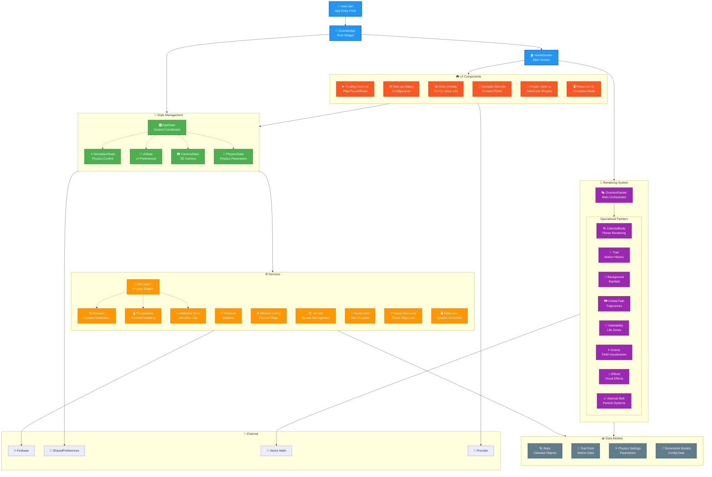

# 🏗️ Graviton Architecture Documentation

This document provides a comprehensive overview of the Graviton app's architecture, design patterns, and implementation details.

## 📋 Table of Contents

- [🎯 Architecture Overview](#-architecture-overview)
- [📊 Architecture Diagram](#-architecture-diagram)
- [🏗️ Layer Breakdown](#️-layer-breakdown)
- [🔄 State Management](#-state-management)
- [🎨 Rendering System](#-rendering-system)
- [⚙️ Service Layer](#️-service-layer)
- [📱 UI Components](#-ui-components)
- [🌐 Internationalization](#-internationalization)
- [🔧 Configuration](#-configuration)
- [📁 Project Structure](#-project-structure)
- [🔗 Dependencies](#-dependencies)
- [🎯 Design Patterns](#-design-patterns)

## 🎯 Architecture Overview

Graviton follows a **clean architecture** approach with clear separation of concerns, ensuring maintainability, testability, and scalability. The app is built using Flutter with the Provider pattern for state management and custom painters for high-performance 3D rendering.

### Core Principles

- **Separation of Concerns**: Each layer has a specific responsibility
- **Dependency Inversion**: High-level modules don't depend on low-level modules
- **Single Responsibility**: Each class has one reason to change
- **Provider Pattern**: Reactive state management throughout the app
- **Modular Design**: Specialized painters and services for different features

## 📊 Architecture Diagram


```mermaid
flowchart TD
    %% Entry Point
    Main["🚀 main.dart<br/>App Entry Point"]
    GravitonApp["📱 GravitonApp<br/>Root Widget"]
    HomeScreen["🏠 HomeScreen<br/>Main Screen"]

    %% State Management
    subgraph SM ["🔄 State Management"]
        direction TB
        AppState["🎛️ AppState<br/>Central Coordinator"]
        SimulationState["⚛️ SimulationState<br/>Physics Control"]
        UIState["🎨 UIState<br/>UI Preferences"]
        CameraState["📷 CameraState<br/>3D Camera"]
        PhysicsState["🧪 PhysicsState<br/>Physics Parameters"]
    end

    %% Services
    subgraph SVC ["⚙️ Services"]
        direction TB
        SimulationSvc["🌌 Simulation<br/>Physics Engine"]
        ScenarioSvc["🪐 Scenario<br/>Content Generation"]
        TempSvc["🌡️ Temperature<br/>Thermal Modeling"]
        HabSvc["🌿 Habitable Zone<br/>Life Zone Calc"]
        FirebaseSvc["🔥 Firebase<br/>Analytics"]
        ConfigSvc["⚙️ Remote Config<br/>Feature Flags"]
        VersionSvc["📦 Version<br/>Update Management"]
        ScreenshotSvc["📸 Screenshot<br/>Dev Features"]
        HapticSvc["📳 Haptic Feedback<br/>Touch Response"]
        FullscreenSvc["🖥️ Fullscreen<br/>System UI Control"]
    end

    %% Rendering
    subgraph RENDER ["🎨 Rendering System"]
        direction TB
        MainPainter["🎭 GravitonPainter<br/>Main Orchestrator"]
        
        subgraph PAINTERS ["Specialized Painters"]
            BodyPainter["🪐 CelestialBody<br/>Planet Rendering"]
            TrailPainter["✨ Trail<br/>Motion History"]
            BgPainter["🌌 Background<br/>Starfield"]
            PathPainter["🛤️ Orbital Path<br/>Trajectories"]
            HabPainter["🌿 Habitability<br/>Life Zones"]
            GravPainter["🌀 Gravity<br/>Field Visualization"]
            FxPainter["💥 Effects<br/>Visual Effects"]
            AsteroidPainter["☄️ Asteroid Belt<br/>Particle Systems"]
        end
    end

    %% UI Components
    subgraph UI ["🎮 UI Components"]
        direction TB
        FloatingControls["▶️ Floating Controls<br/>Play/Pause/Reset"]
        SettingsDialog["⚙️ Settings Dialog<br/>Configuration"]
        StatsOverlay["📊 Stats Overlay<br/>Performance Info"]
        ScenarioSelector["🎯 Scenario Selector<br/>Content Picker"]
        HapticControls["📳 Haptic Controls<br/>Feedback Widgets"]
        FullscreenUI["🖥️ Fullscreen UI<br/>Immersive Mode"]
    end

    %% Models
    subgraph MODELS ["📊 Data Models"]
        direction TB
        Body["🪐 Body<br/>Celestial Objects"]
        TrailPoint["📍 Trail Point<br/>Motion Data"]
        PhysicsSettings["⚛️ Physics Settings<br/>Parameters"]
        ScreenshotModels["📸 Screenshot Models<br/>Config Data"]
    end

    %% External Dependencies
    subgraph EXT ["🔌 External"]
        direction TB
        Firebase["🔥 Firebase"]
        SharedPrefs["💾 SharedPreferences"]
        VectorMath["📐 Vector Math"]
        Provider["🔗 Provider"]
    end

    %% Main Flow
    Main --> GravitonApp
    GravitonApp --> HomeScreen
    GravitonApp --> SM
    
    %% Screen to Components
    HomeScreen --> UI
    HomeScreen --> RENDER
    
    %% State to Services
    SM --> SVC
    SM --> SharedPrefs
    
    %% Services to Models and External
    SVC --> MODELS
    SVC --> Firebase
    
    %% Rendering to Utils and Models
    RENDER --> MODELS
    RENDER --> VectorMath
    
    %% UI to State
    UI --> SM
    UI --> Provider
    
    %% State relationships
    AppState -.-> SimulationState
    AppState -.-> UIState
    AppState -.-> CameraState
    AppState -.-> PhysicsState
    
    %% Service relationships
    SimulationSvc -.-> ScenarioSvc
    SimulationSvc -.-> TempSvc
    SimulationSvc -.-> HabSvc
    
    %% Painter orchestration
    MainPainter --> PAINTERS

    %% Styling
    classDef primaryNode fill:#2196F3,stroke:#1976D2,stroke-width:3px,color:#fff
    classDef stateNode fill:#4CAF50,stroke:#388E3C,stroke-width:2px,color:#fff
    classDef serviceNode fill:#FF9800,stroke:#F57C00,stroke-width:2px,color:#fff
    classDef renderNode fill:#9C27B0,stroke:#7B1FA2,stroke-width:2px,color:#fff
    classDef uiNode fill:#FF5722,stroke:#D84315,stroke-width:2px,color:#fff
    classDef modelNode fill:#607D8B,stroke:#455A64,stroke-width:2px,color:#fff
    classDef extNode fill:#795548,stroke:#5D4037,stroke-width:2px,color:#fff
    
    class Main,GravitonApp,HomeScreen primaryNode
    class AppState,SimulationState,UIState,CameraState,PhysicsState stateNode
    class SimulationSvc,ScenarioSvc,TempSvc,HabSvc,FirebaseSvc,ConfigSvc,VersionSvc,ScreenshotSvc,HapticSvc,FullscreenSvc serviceNode
    class MainPainter,BodyPainter,TrailPainter,BgPainter,PathPainter,HabPainter,GravPainter,FxPainter,AsteroidPainter renderNode
    class FloatingControls,SettingsDialog,StatsOverlay,ScenarioSelector,HapticControls,FullscreenUI uiNode
    class Body,TrailPoint,PhysicsSettings,ScreenshotModels modelNode
```

## 🏗️ Layer Breakdown

### 1. Presentation Layer

**HomeScreen** serves as the main application screen, orchestrating:
- Canvas for 3D simulation rendering
- Overlay UI controls and dialogs
- Gesture handling for camera control
- Screenshot mode functionality

### 2. State Management Layer

Built on the **Provider pattern** with hierarchical state management:

- **AppState**: Central coordinator managing all child states
- **SimulationState**: Controls physics simulation lifecycle
- **UIState**: Manages visual settings and user preferences
- **CameraState**: Handles 3D camera positioning and movement
- **PhysicsState**: Per-scenario physics parameter management

### 3. Service Layer

Business logic and external integrations:

- **Core Physics**: Gravitational calculations and collision detection
- **Scenario Management**: Predefined astronomical setups
- **Environmental Services**: Temperature and habitability calculations
- **External Services**: Firebase analytics, remote config, version management

### 4. Rendering Layer

High-performance custom painters using Flutter's Canvas API:

- **Modular Design**: Specialized painters for different visual elements
- **3D Mathematics**: Vector transformations and projections
- **Performance Optimized**: Efficient rendering for 60fps target

### 5. Model Layer

Pure data classes representing domain entities:

- **Celestial Bodies**: Position, velocity, mass, and visual properties
- **Physics Parameters**: Configurable simulation constants
- **Configuration Models**: Settings and preferences

## 🔄 State Management

### Provider Pattern Implementation

```dart
// Hierarchical state management
AppState
├── SimulationState (physics simulation)
├── UIState (user preferences)
├── CameraState (3D camera control)
└── PhysicsState (physics parameters)
```

### State Synchronization

- **Reactive Updates**: All UI components listen to relevant state changes
- **Persistence**: Settings automatically saved to SharedPreferences
- **Error Handling**: Centralized error management through AppState

### Language Handling

Dynamic language switching with proper state management:
- Language changes trigger UI rebuilds
- Scenario names update with new localization
- Persistent language preference storage

## 🎨 Rendering System

### Custom Painter Architecture

The rendering system uses a **main orchestrator pattern**:

```dart
GravitonPainter (Main Orchestrator)
├── BackgroundPainter (starfield, galaxies)
├── TrailPainter (motion history)
├── OrbitalPathPainter (predictive paths)
├── HabitabilityPainter (life zones)
├── CelestialBodyPainter (planets, rings)
├── GravityPainter (field visualization)
├── EffectsPainter (collisions, flashes)
└── AsteroidBeltPainter (particle systems)
```

### 3D Mathematics

- **Vector Math**: Using `vector_math` library for matrix operations
- **Projection**: 3D world coordinates to 2D screen coordinates
- **Depth Sorting**: Back-to-front rendering for proper visual layering
- **Camera System**: Full 3D camera with pan, zoom, and rotation

### Performance Optimization

- **Efficient Trail Rendering**: Configurable opacity and warm/cool modes
- **Culling**: Objects outside view frustum aren't rendered
- **LOD System**: Distance-based level of detail for complex objects
- **Batch Rendering**: Multiple particles rendered efficiently

## ⚙️ Service Layer

### Core Physics Engine

**Simulation Service** implements:
- **N-body Gravitational Simulation**: Real-time physics calculations
- **Collision Detection**: Accurate body-to-body collision handling
- **Trail Management**: Motion history tracking and rendering
- **Time Scaling**: Adjustable simulation speed

### Scenario Management

**Scenario Service** provides:
- **Predefined Setups**: Solar system, binary stars, three-body problems
- **Astronomical Accuracy**: Realistic orbital mechanics
- **Dynamic Generation**: Procedural content for educational scenarios

### Environmental Services

- **Temperature Service**: Stellar radiation and planetary temperature modeling
- **Habitable Zone Service**: Life zone calculations and habitability status
- **Asteroid Belt System**: Particle-based belt rendering

### External Services

- **Firebase Integration**: Analytics, crashlytics, and remote configuration
- **Version Management**: Dual-threshold update system
- **Screenshot Mode**: Development-only feature for marketing materials
- **Haptic Feedback Service**: Coordinated touch response feedback system
- **Fullscreen Service**: System UI control for immersive viewing experience

## 📱 UI Components

### Modular Widget Design

- **Floating Controls**: Video-style play/pause/reset controls with haptic feedback
- **Settings Dialog**: Comprehensive configuration interface with haptic controls
- **Stats Overlay**: Real-time performance and physics data
- **Scenario Selector**: Educational scenario picker with haptic interactions
- **Bottom Controls**: Camera and UI toggle controls with feedback
- **Haptic Widget Library**: Comprehensive set of haptic-enabled UI components
- **Fullscreen Integration**: Tap-to-toggle fullscreen mode with system UI control

### Responsive Design

- **Adaptive Layout**: Works across phone, tablet, and web platforms
- **Gesture Handling**: Intuitive touch controls for 3D navigation with haptic feedback
- **Accessibility**: Screen reader support, semantic labels, and configurable haptics
- **Immersive Mode**: Fullscreen support with tap gestures for maximum viewing area

## 🌐 Internationalization

### Multi-language Support

- **7 Languages**: English, Spanish, French, German, Chinese, Japanese, Korean
- **ARB Format**: Industry-standard localization files
- **Dynamic Switching**: Runtime language changes
- **Educational Content**: Scenario names and descriptions localized

### Implementation

```dart
// Localization structure
l10n/
├── app_en.arb (template)
├── app_es.arb
├── app_fr.arb
├── app_de.arb
├── app_zh.arb
├── app_ja.arb
└── app_ko.arb
```

## 🔧 Configuration

### Build Variants

**Flavor Configuration** supports:
- **Development**: Debug features, screenshot mode, verbose logging
- **Production**: Optimized performance, analytics enabled

### Constants Management

- **Physics Constants**: Gravitational parameters, collision settings
- **Rendering Constants**: 3D projection parameters, visual settings
- **Educational Focus**: Keys for educational content organization

## 📁 Project Structure

### Root Directory Structure

```
graviton/
├── .github/                     # GitHub workflows and templates
├── android/                     # Android platform configuration
│   ├── app/                    # Android app module
│   ├── fastlane/               # Android deployment automation
│   └── gradle/                 # Gradle build system
├── ios/                         # iOS platform configuration
│   ├── Runner/                 # iOS app target
│   ├── fastlane/               # iOS deployment automation
│   └── Runner.xcodeproj/       # Xcode project
├── web/                         # Web platform configuration
├── assets/                      # Application assets
│   ├── images/                 # Image resources
│   └── screenshots/            # Platform screenshots
├── config/                      # Environment configurations
│   ├── dev.json               # Development configuration
│   └── prod.json              # Production configuration
├── docs/                        # Documentation
│   ├── ARCHITECTURE.md        # This file
│   ├── CAMERA_TECHNIQUES.md   # Camera system documentation
│   ├── FASTLANE.md           # Deployment documentation
│   └── MARKETING.md          # Marketing materials
├── test/                        # Test suites
│   ├── constants/             # Constants tests
│   ├── core/                  # Core functionality tests
│   ├── debug/                 # Debug utilities tests
│   ├── demos/                 # Demo scenario tests
│   ├── enums/                 # Enumeration tests
│   ├── features/              # Feature-specific tests
│   ├── integration/           # Integration tests
│   ├── models/                # Model tests
│   ├── painters/              # Painter tests
│   ├── scenarios/             # Scenario tests
│   ├── services/              # Service tests
│   ├── state/                 # State management tests
│   ├── utils/                 # Utility tests
│   └── widgets/               # Widget tests
├── tools/                       # Development tools
│   ├── generate_keystore.sh   # Android keystore generation
│   ├── generate_screenshots.py # Screenshot automation
│   └── generate_screenshots.sh # Screenshot shell script
├── keys/                        # Deployment keys (gitignored)
├── coverage/                    # Test coverage reports
├── build/                       # Build artifacts
├── lib/                         # Flutter application source
└── Configuration Files
    ├── pubspec.yaml            # Package dependencies
    ├── l10n.yaml              # Localization configuration
    ├── analysis_options.yaml  # Static analysis rules
    ├── README.md              # Project overview
    ├── CHANGELOG.md           # Version history
    ├── CONTRIBUTING.md        # Contribution guidelines
    ├── LICENSE.md             # License information
    └── PRIVACY.md             # Privacy policy
```

### Application Source Structure

```
lib/
├── main.dart                    # App entry point
├── config/                      # Configuration management
│   └── flavor_config.dart      # App flavor configuration
├── constants/                   # Application constants
│   ├── educational_focus_keys.dart # Educational content keys
│   ├── rendering_constants.dart # Rendering system constants
│   ├── simulation_constants.dart # Physics simulation constants
│   └── test_constants.dart     # Testing configuration constants
├── enums/                       # Type definitions
│   ├── ab_test_group.dart      # A/B testing groups
│   ├── app_bar_menu_item.dart  # App bar menu options
│   ├── app_flavor.dart         # Application flavors
│   ├── auto_rotate_status.dart # Screen rotation status
│   ├── body_type.dart          # Celestial body types
│   ├── celestial_body_name.dart # Body name enumeration
│   ├── changelog_category.dart # Change log categories
│   ├── cinematic_camera_technique.dart # Camera movement types
│   ├── firebase_event.dart     # Analytics event types
│   ├── gravity_field_color_scheme.dart # Gravity visualization colors
│   ├── habitability_status.dart # Life zone status types
│   ├── notification_type.dart  # System notification types
│   ├── scenario_type.dart      # Educational scenario types
│   ├── simulation_status.dart  # Physics simulation states
│   ├── speed_preset.dart       # Time speed presets
│   ├── tutorial_action.dart    # Tutorial interaction types
│   ├── ui_action.dart          # User interface actions
│   ├── ui_element.dart         # UI component types
│   ├── user_behavior_tracking_mode.dart # Analytics tracking modes
│   └── version_status.dart     # App version status types
├── l10n/                        # Internationalization
│   ├── app_localizations.dart  # Generated localizations base
│   ├── app_localizations_de.dart # German localizations
│   ├── app_localizations_en.dart # English localizations
│   ├── app_localizations_es.dart # Spanish localizations
│   ├── app_localizations_fr.dart # French localizations
│   ├── app_localizations_ja.dart # Japanese localizations
│   ├── app_localizations_ko.dart # Korean localizations
│   ├── app_localizations_zh.dart # Chinese localizations
│   ├── app_de.arb             # German translations
│   ├── app_en.arb             # English translations
│   ├── app_es.arb             # Spanish translations
│   ├── app_fr.arb             # French translations
│   ├── app_ja.arb             # Japanese translations
│   ├── app_ko.arb             # Korean translations
│   └── app_zh.arb             # Chinese translations
├── models/                      # Data models
│   ├── asteroid_particle.dart  # Asteroid system data
│   ├── body.dart               # Celestial body model
│   ├── camera_position.dart    # 3D camera state
│   ├── changelog.dart          # Version changelog
│   ├── changelog_entry.dart    # Individual change entries
│   ├── changelog_version.dart  # Version metadata
│   ├── merge_flash.dart        # Collision effects
│   ├── orbital_event.dart      # Orbital mechanics events
│   ├── orbital_parameters.dart # Keplerian elements
│   ├── physics_settings.dart   # Physics configuration
│   ├── platform_version_config.dart # Platform-specific config
│   ├── preset_scenario.dart    # Educational scenarios
│   ├── ring_particle.dart      # Planetary ring systems
│   ├── scenario_config.dart    # Scenario definitions
│   ├── screenshot_models.dart  # Screenshot system data
│   ├── screenshot_preset.dart  # Screenshot configurations
│   ├── screenshot_presets.dart # Predefined screenshot sets
│   ├── sunspot_data.dart       # Solar activity data
│   ├── trail_point.dart        # Motion trail data
│   └── tutorial_step.dart      # Tutorial system data
├── services/                    # Business logic services
│   ├── asteroid_belt_system.dart # Asteroid belt simulation
│   ├── changelog_service.dart  # Version change management
│   ├── cinematic_camera_controller.dart # Automated camera movements
│   ├── firebase_service.dart   # Firebase integration
│   ├── fullscreen_service.dart # System UI control
│   ├── habitable_zone_service.dart # Life zone calculations
│   ├── haptic_feedback_service.dart # Touch feedback
│   ├── onboarding_service.dart # User onboarding
│   ├── orbital_prediction_engine.dart # Orbital mechanics
│   ├── remote_config_service.dart # Feature flag management
│   ├── scenario_service.dart   # Educational content
│   ├── screenshot_mode_service.dart # Development tools
│   ├── simulation.dart         # Core physics engine
│   ├── stellar_color_service.dart # Star color calculations
│   ├── temperature_service.dart # Thermal modeling
│   └── version_service.dart    # App version management
├── state/                       # State management
│   ├── app_state.dart          # Central application state
│   ├── camera_state.dart       # 3D camera state
│   ├── physics_state.dart      # Physics parameters state
│   ├── simulation_state.dart   # Simulation control state
│   └── ui_state.dart           # UI preferences state
├── utils/                       # Utility functions
│   ├── app_utils.dart          # General utilities
│   ├── camera_utils.dart       # Camera calculations
│   ├── color_utils.dart        # Color manipulation
│   ├── constants_manager.dart  # Dynamic constants
│   ├── fullscreen_utils.dart   # Fullscreen coordination
│   ├── haptic_utils.dart       # Haptic feedback utilities
│   ├── math_utils.dart         # Mathematical operations
│   ├── physics_utils.dart      # Physics calculations
│   ├── platform_utils.dart     # Platform detection
│   ├── screenshot_utils.dart   # Screenshot functionality
│   └── vector_utils.dart       # 3D vector operations
├── painters/                    # Custom rendering engines
│   ├── asteroid_belt_painter.dart # Asteroid belt visualization
│   ├── background_painter.dart # Starfield background
│   ├── celestial_body_painter.dart # Planet/star rendering
│   ├── effects_painter.dart    # Visual effects
│   ├── graviton_painter.dart   # Main orchestrator
│   ├── gravity_painter.dart    # Gravity field visualization
│   ├── habitability_painter.dart # Habitable zone rendering
│   ├── highlight_painter.dart  # Object highlighting
│   ├── orbital_path_painter.dart # Trajectory visualization
│   └── trail_painter.dart      # Motion trail rendering
├── widgets/                     # UI components
│   ├── common/                 # Reusable haptic-enabled widgets
│   │   ├── action_option.dart  # Action button component
│   │   ├── dialog_title.dart   # Standardized dialog titles
│   │   ├── haptic_app_bar.dart # Haptic-enabled app bar
│   │   ├── haptic_elevated_button.dart # Haptic elevated button
│   │   ├── haptic_gesture_detector.dart # Haptic gesture handling
│   │   ├── haptic_icon_button.dart # Haptic icon button
│   │   ├── haptic_ink_well.dart # Haptic ink well
│   │   ├── haptic_list_tile.dart # Haptic list tile
│   │   ├── haptic_slider_option.dart # Haptic slider control
│   │   ├── haptic_switch.dart  # Haptic switch widget
│   │   ├── haptic_switch_list_tile.dart # Haptic switch list tile
│   │   ├── haptic_text_button.dart # Haptic text button
│   │   └── toggle_option.dart  # Toggle control component
│   ├── app_bar_speed_control.dart # App bar speed controls
│   ├── auto_pause_dialog_wrapper.dart # Auto-pause functionality
│   ├── body_labels_overlay.dart # Object labeling overlay
│   ├── body_properties_dialog.dart # Object property editor
│   ├── body_property_editor_overlay.dart # In-place property editing
│   ├── bottom_sheet_handle.dart # Bottom sheet drag handle
│   ├── bottom_sheet_header.dart # Bottom sheet header
│   ├── camera_action_button.dart # Camera control button
│   ├── camera_controls.dart    # Camera control panel
│   ├── camera_mode_option.dart # Camera mode selector
│   ├── changelog_dialog.dart   # Version changelog display
│   ├── copyright_text.dart     # Copyright information
│   ├── dev_ribbon.dart         # Development mode indicator
│   ├── maintenance_dialog.dart # Maintenance mode dialog
│   ├── offscreen_indicators_overlay.dart # Off-screen object indicators
│   ├── options_drawer.dart     # Settings drawer
│   ├── persistent_bottom_sheet.dart # Persistent bottom controls
│   ├── physics_controls.dart   # Physics parameter controls
│   ├── screenshot_countdown.dart # Screenshot countdown timer
│   ├── screenshot_mode_widget.dart # Screenshot mode interface
│   ├── section_title.dart      # Section header component
│   ├── stats_overlay.dart      # Performance statistics
│   ├── tutorial_overlay.dart   # Tutorial system interface
│   ├── version_check_dialog.dart # Version update dialog
│   └── visuals_controls.dart   # Visual settings controls
├── screens/                     # Application screens
│   ├── about_screen.dart       # About/credits screen
│   ├── application_settings_screen.dart # App-wide settings
│   ├── developer_tools_screen.dart # Development utilities
│   ├── help_screen.dart        # User help and tutorials
│   ├── home_screen.dart        # Main simulation screen
│   ├── physics_settings_screen.dart # Physics parameter settings
│   └── scenario_selection_screen.dart # Educational scenario picker
└── theme/                       # Design system
    ├── app_colors.dart         # Color palette definitions
    ├── app_constraints.dart    # Layout constraints and dimensions
    └── app_typography.dart     # Typography system and text styles
```

## 🔗 Dependencies

### Core Dependencies

- **Flutter SDK**: Cross-platform UI framework
- **Provider**: State management solution
- **Vector Math**: 3D mathematics library
- **Shared Preferences**: Local data persistence

### Firebase Dependencies

- **Firebase Core**: Firebase initialization
- **Firebase Analytics**: User behavior tracking
- **Firebase Crashlytics**: Error reporting
- **Firebase Remote Config**: Feature flag management

### Development Dependencies

- **Flutter Test**: Unit and widget testing
- **Integration Test**: End-to-end testing
- **Build Runner**: Code generation
- **Flutter Launcher Icons**: Icon generation

## 🎯 Design Patterns

### Implemented Patterns

1. **Provider Pattern**: Reactive state management
2. **Orchestrator Pattern**: Main painter coordinates specialized painters
3. **Service Layer Pattern**: Business logic encapsulation
4. **Repository Pattern**: Data access abstraction
5. **Observer Pattern**: State change notifications
6. **Strategy Pattern**: Different rendering strategies for objects
7. **Factory Pattern**: Scenario and object creation
8. **Singleton Pattern**: Service instances and configuration

### Architecture Benefits

- **Maintainability**: Clear separation of concerns
- **Testability**: Each layer can be tested independently
- **Scalability**: Easy to add new features and scenarios
- **Performance**: Optimized rendering and physics calculations
- **Educational Value**: Clean code serves as learning resource

## 🧪 Testing Strategy

### Comprehensive Test Coverage

The project maintains extensive test coverage across all architectural layers:

```
test/
├── constants/          # Physics and app constants tests
├── core/              # Core functionality tests
├── debug/             # Debug utilities tests  
├── demos/             # Scenario demonstration tests
├── enums/             # Enumeration value tests
├── features/          # Feature-specific test suites
├── integration/       # End-to-end integration tests
├── models/            # Data model validation tests
├── painters/          # Custom painter tests
├── scenarios/         # Physics scenario tests
├── services/          # Service layer tests (haptic, fullscreen, physics)
├── state/             # State management tests
├── utils/             # Utility function tests
└── widgets/           # UI component tests (including haptic widgets)
```

### Test Categories

- **Unit Tests**: Individual function and class validation
- **Widget Tests**: UI component behavior and rendering
- **Integration Tests**: Service interaction and state management
- **Physics Tests**: Gravitational calculations and numerical stability
- **Performance Tests**: Rendering efficiency and memory usage
- **Accessibility Tests**: Screen reader and haptic feedback validation

### Testing Tools

- **Flutter Test**: Unit and widget testing framework
- **Integration Test**: End-to-end testing
- **Golden Tests**: Visual regression testing for painters
- **Physics Validation**: Numerical accuracy testing for orbital mechanics

---

## 📚 Related Documentation

- [README.md](../README.md) - Project overview and getting started
- [CONTRIBUTING.md](../CONTRIBUTING.md) - Development guidelines
- [docs/CAMERA_TECHNIQUES.md](CAMERA_TECHNIQUES.md) - Camera system documentation
- [test/README.md](../test/README.md) - Testing strategy and organization

---

*This architecture documentation is maintained alongside the codebase and should be updated when significant architectural changes are made.*