# 🏗️ Graviton Architecture Documentation

This document provides a comprehensive overview of the Graviton app's architecture, design patterns, and implementation details.

## 📋 Table of Contents

- [🎯 Architecture Overview](#-architecture-overview)
- [📊 Architecture Diagram](#-architecture-diagram)
- [🏗️ Layer Breakdown](#️-layer-breakdown)
- [🔄 State Management](#-state-management)
- [🎨 Rendering System](#-rendering-system)
- [⚙️ Service Layer](#️-service-layer)
- [📱 UI Components](#-ui-components)
- [🌐 Internationalization](#-internationalization)
- [🔧 Configuration](#-configuration)
- [📁 Project Structure](#-project-structure)
- [🔗 Dependencies](#-dependencies)
- [🎯 Design Patterns](#-design-patterns)

## 🎯 Architecture Overview

Graviton follows a **clean architecture** approach with clear separation of concerns, ensuring maintainability, testability, and scalability. The app is built using Flutter with the Provider pattern for state management and custom painters for high-performance 3D rendering.

### Core Principles

- **Separation of Concerns**: Each layer has a specific responsibility
- **Dependency Inversion**: High-level modules don't depend on low-level modules
- **Single Responsibility**: Each class has one reason to change
- **Provider Pattern**: Reactive state management throughout the app
- **Modular Design**: Specialized painters and services for different features

## 📊 Architecture Diagram

```mermaid
flowchart TD
    %% Entry Point
    Main["🚀 main.dart<br/>App Entry Point"]
    GravitonApp["📱 GravitonApp<br/>Root Widget"]
    HomeScreen["🏠 HomeScreen<br/>Main Screen"]

    %% State Management
    subgraph SM ["🔄 State Management"]
        direction TB
        AppState["🎛️ AppState<br/>Central Coordinator"]
        SimulationState["⚛️ SimulationState<br/>Physics Control"]
        UIState["🎨 UIState<br/>UI Preferences"]
        CameraState["📷 CameraState<br/>3D Camera"]
        PhysicsState["🧪 PhysicsState<br/>Physics Parameters"]
    end

    %% Services
    subgraph SVC ["⚙️ Services"]
        direction TB
        SimulationSvc["🌌 Simulation<br/>Physics Engine"]
        ScenarioSvc["🪐 Scenario<br/>Content Generation"]
        TempSvc["🌡️ Temperature<br/>Thermal Modeling"]
        HabSvc["🌿 Habitable Zone<br/>Life Zone Calc"]
        FirebaseSvc["🔥 Firebase<br/>Analytics"]
        ConfigSvc["⚙️ Remote Config<br/>Feature Flags"]
        VersionSvc["📦 Version<br/>Update Management"]
        ScreenshotSvc["📸 Screenshot<br/>Dev Features"]
    end

    %% Rendering
    subgraph RENDER ["🎨 Rendering System"]
        direction TB
        MainPainter["🎭 GravitonPainter<br/>Main Orchestrator"]
        
        subgraph PAINTERS ["Specialized Painters"]
            BodyPainter["🪐 CelestialBody<br/>Planet Rendering"]
            TrailPainter["✨ Trail<br/>Motion History"]
            BgPainter["🌌 Background<br/>Starfield"]
            PathPainter["🛤️ Orbital Path<br/>Trajectories"]
            HabPainter["🌿 Habitability<br/>Life Zones"]
            GravPainter["🌀 Gravity<br/>Field Visualization"]
            FxPainter["💥 Effects<br/>Visual Effects"]
            AsteroidPainter["☄️ Asteroid Belt<br/>Particle Systems"]
        end
    end

    %% UI Components
    subgraph UI ["🎮 UI Components"]
        direction TB
        FloatingControls["▶️ Floating Controls<br/>Play/Pause/Reset"]
        SettingsDialog["⚙️ Settings Dialog<br/>Configuration"]
        BottomControls["📱 Bottom Controls<br/>Camera & UI"]
        StatsOverlay["📊 Stats Overlay<br/>Performance Info"]
        ScenarioSelector["🎯 Scenario Selector<br/>Content Picker"]
    end

    %% Models
    subgraph MODELS ["📊 Data Models"]
        direction TB
        Body["🪐 Body<br/>Celestial Objects"]
        TrailPoint["📍 Trail Point<br/>Motion Data"]
        PhysicsSettings["⚛️ Physics Settings<br/>Parameters"]
        ScreenshotModels["📸 Screenshot Models<br/>Config Data"]
    end

    %% External Dependencies
    subgraph EXT ["🔌 External"]
        direction TB
        Firebase["🔥 Firebase"]
        SharedPrefs["💾 SharedPreferences"]
        VectorMath["📐 Vector Math"]
        Provider["🔗 Provider"]
    end

    %% Main Flow
    Main --> GravitonApp
    GravitonApp --> HomeScreen
    GravitonApp --> SM
    
    %% Screen to Components
    HomeScreen --> UI
    HomeScreen --> RENDER
    
    %% State to Services
    SM --> SVC
    SM --> SharedPrefs
    
    %% Services to Models and External
    SVC --> MODELS
    SVC --> Firebase
    
    %% Rendering to Utils and Models
    RENDER --> MODELS
    RENDER --> VectorMath
    
    %% UI to State
    UI --> SM
    UI --> Provider
    
    %% State relationships
    AppState -.-> SimulationState
    AppState -.-> UIState
    AppState -.-> CameraState
    AppState -.-> PhysicsState
    
    %% Service relationships
    SimulationSvc -.-> ScenarioSvc
    SimulationSvc -.-> TempSvc
    SimulationSvc -.-> HabSvc
    
    %% Painter orchestration
    MainPainter --> PAINTERS

    %% Styling
    classDef primaryNode fill:#2196F3,stroke:#1976D2,stroke-width:3px,color:#fff
    classDef stateNode fill:#4CAF50,stroke:#388E3C,stroke-width:2px,color:#fff
    classDef serviceNode fill:#FF9800,stroke:#F57C00,stroke-width:2px,color:#fff
    classDef renderNode fill:#9C27B0,stroke:#7B1FA2,stroke-width:2px,color:#fff
    classDef uiNode fill:#FF5722,stroke:#D84315,stroke-width:2px,color:#fff
    classDef modelNode fill:#607D8B,stroke:#455A64,stroke-width:2px,color:#fff
    classDef extNode fill:#795548,stroke:#5D4037,stroke-width:2px,color:#fff
    
    class Main,GravitonApp,HomeScreen primaryNode
    class AppState,SimulationState,UIState,CameraState,PhysicsState stateNode
    class SimulationSvc,ScenarioSvc,TempSvc,HabSvc,FirebaseSvc,ConfigSvc,VersionSvc,ScreenshotSvc serviceNode
    class MainPainter,BodyPainter,TrailPainter,BgPainter,PathPainter,HabPainter,GravPainter,FxPainter,AsteroidPainter renderNode
    class FloatingControls,SettingsDialog,BottomControls,StatsOverlay,ScenarioSelector uiNode
    class Body,TrailPoint,PhysicsSettings,ScreenshotModels modelNode
```



## 🏗️ Layer Breakdown

### 1. Presentation Layer

**HomeScreen** serves as the main application screen, orchestrating:
- Canvas for 3D simulation rendering
- Overlay UI controls and dialogs
- Gesture handling for camera control
- Screenshot mode functionality

### 2. State Management Layer

Built on the **Provider pattern** with hierarchical state management:

- **AppState**: Central coordinator managing all child states
- **SimulationState**: Controls physics simulation lifecycle
- **UIState**: Manages visual settings and user preferences
- **CameraState**: Handles 3D camera positioning and movement
- **PhysicsState**: Per-scenario physics parameter management

### 3. Service Layer

Business logic and external integrations:

- **Core Physics**: Gravitational calculations and collision detection
- **Scenario Management**: Predefined astronomical setups
- **Environmental Services**: Temperature and habitability calculations
- **External Services**: Firebase analytics, remote config, version management

### 4. Rendering Layer

High-performance custom painters using Flutter's Canvas API:

- **Modular Design**: Specialized painters for different visual elements
- **3D Mathematics**: Vector transformations and projections
- **Performance Optimized**: Efficient rendering for 60fps target

### 5. Model Layer

Pure data classes representing domain entities:

- **Celestial Bodies**: Position, velocity, mass, and visual properties
- **Physics Parameters**: Configurable simulation constants
- **Configuration Models**: Settings and preferences

## 🔄 State Management

### Provider Pattern Implementation

```dart
// Hierarchical state management
AppState
├── SimulationState (physics simulation)
├── UIState (user preferences)
├── CameraState (3D camera control)
└── PhysicsState (physics parameters)
```

### State Synchronization

- **Reactive Updates**: All UI components listen to relevant state changes
- **Persistence**: Settings automatically saved to SharedPreferences
- **Error Handling**: Centralized error management through AppState

### Language Handling

Dynamic language switching with proper state management:
- Language changes trigger UI rebuilds
- Scenario names update with new localization
- Persistent language preference storage

## 🎨 Rendering System

### Custom Painter Architecture

The rendering system uses a **main orchestrator pattern**:

```dart
GravitonPainter (Main Orchestrator)
├── BackgroundPainter (starfield, galaxies)
├── TrailPainter (motion history)
├── OrbitalPathPainter (predictive paths)
├── HabitabilityPainter (life zones)
├── CelestialBodyPainter (planets, rings)
├── GravityPainter (field visualization)
├── EffectsPainter (collisions, flashes)
└── AsteroidBeltPainter (particle systems)
```

### 3D Mathematics

- **Vector Math**: Using `vector_math` library for matrix operations
- **Projection**: 3D world coordinates to 2D screen coordinates
- **Depth Sorting**: Back-to-front rendering for proper visual layering
- **Camera System**: Full 3D camera with pan, zoom, and rotation

### Performance Optimization

- **Efficient Trail Rendering**: Configurable opacity and warm/cool modes
- **Culling**: Objects outside view frustum aren't rendered
- **LOD System**: Distance-based level of detail for complex objects
- **Batch Rendering**: Multiple particles rendered efficiently

## ⚙️ Service Layer

### Core Physics Engine

**Simulation Service** implements:
- **N-body Gravitational Simulation**: Real-time physics calculations
- **Collision Detection**: Accurate body-to-body collision handling
- **Trail Management**: Motion history tracking and rendering
- **Time Scaling**: Adjustable simulation speed

### Scenario Management

**Scenario Service** provides:
- **Predefined Setups**: Solar system, binary stars, three-body problems
- **Astronomical Accuracy**: Realistic orbital mechanics
- **Dynamic Generation**: Procedural content for educational scenarios

### Environmental Services

- **Temperature Service**: Stellar radiation and planetary temperature modeling
- **Habitable Zone Service**: Life zone calculations and habitability status
- **Asteroid Belt System**: Particle-based belt rendering

### External Services

- **Firebase Integration**: Analytics, crashlytics, and remote configuration
- **Version Management**: Dual-threshold update system
- **Screenshot Mode**: Development-only feature for marketing materials

## 📱 UI Components

### Modular Widget Design

- **Floating Controls**: Video-style play/pause/reset controls
- **Settings Dialog**: Comprehensive configuration interface
- **Stats Overlay**: Real-time performance and physics data
- **Scenario Selector**: Educational scenario picker
- **Bottom Controls**: Camera and UI toggle controls

### Responsive Design

- **Adaptive Layout**: Works across phone, tablet, and web platforms
- **Gesture Handling**: Intuitive touch controls for 3D navigation
- **Accessibility**: Screen reader support and semantic labels

## 🌐 Internationalization

### Multi-language Support

- **7 Languages**: English, Spanish, French, German, Chinese, Japanese, Korean
- **ARB Format**: Industry-standard localization files
- **Dynamic Switching**: Runtime language changes
- **Educational Content**: Scenario names and descriptions localized

### Implementation

```dart
// Localization structure
l10n/
├── app_en.arb (template)
├── app_es.arb
├── app_fr.arb
├── app_de.arb
├── app_zh.arb
├── app_ja.arb
└── app_ko.arb
```

## 🔧 Configuration

### Build Variants

**Flavor Configuration** supports:
- **Development**: Debug features, screenshot mode, verbose logging
- **Production**: Optimized performance, analytics enabled

### Constants Management

- **Physics Constants**: Gravitational parameters, collision settings
- **Rendering Constants**: 3D projection parameters, visual settings
- **Educational Focus**: Keys for educational content organization

## 📁 Project Structure

```
lib/
├── main.dart                     # App entry point
├── config/                       # Configuration management
├── constants/                    # Application constants
├── enums/                        # Type definitions
├── l10n/                        # Internationalization
├── models/                      # Data models
├── services/                    # Business logic
├── state/                       # State management
├── utils/                       # Utilities
├── painters/                    # Rendering engines
├── widgets/                     # UI components
├── screens/                     # Application screens
└── theme/                       # Design system
```

## 🔗 Dependencies

### Core Dependencies

- **Flutter SDK**: Cross-platform UI framework
- **Provider**: State management solution
- **Vector Math**: 3D mathematics library
- **Shared Preferences**: Local data persistence

### Firebase Dependencies

- **Firebase Core**: Firebase initialization
- **Firebase Analytics**: User behavior tracking
- **Firebase Crashlytics**: Error reporting
- **Firebase Remote Config**: Feature flag management

### Development Dependencies

- **Flutter Test**: Unit and widget testing
- **Integration Test**: End-to-end testing
- **Build Runner**: Code generation
- **Flutter Launcher Icons**: Icon generation

## 🎯 Design Patterns

### Implemented Patterns

1. **Provider Pattern**: Reactive state management
2. **Orchestrator Pattern**: Main painter coordinates specialized painters
3. **Service Layer Pattern**: Business logic encapsulation
4. **Repository Pattern**: Data access abstraction
5. **Observer Pattern**: State change notifications
6. **Strategy Pattern**: Different rendering strategies for objects
7. **Factory Pattern**: Scenario and object creation
8. **Singleton Pattern**: Service instances and configuration

### Architecture Benefits

- **Maintainability**: Clear separation of concerns
- **Testability**: Each layer can be tested independently
- **Scalability**: Easy to add new features and scenarios
- **Performance**: Optimized rendering and physics calculations
- **Educational Value**: Clean code serves as learning resource

---

## 📚 Related Documentation

- [README.md](../README.md) - Project overview and getting started
- [CONTRIBUTING.md](../CONTRIBUTING.md) - Development guidelines
- [docs/CAMERA_TECHNIQUES.md](CAMERA_TECHNIQUES.md) - Camera system documentation
- [test/README.md](../test/README.md) - Testing strategy and organization

---

*This architecture documentation is maintained alongside the codebase and should be updated when significant architectural changes are made.*