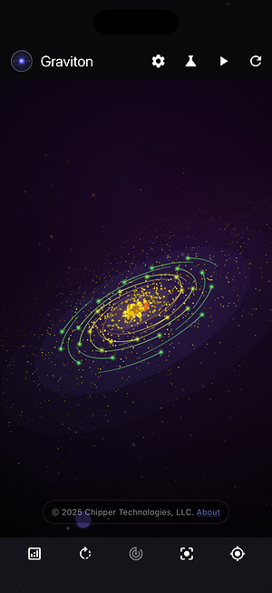
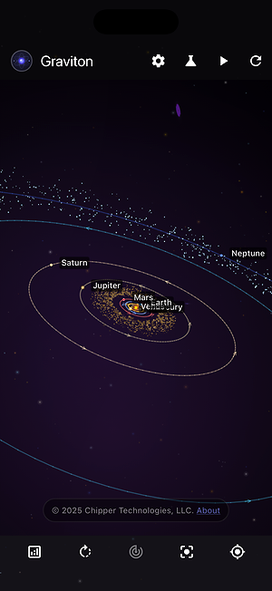
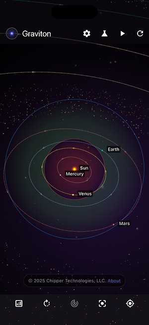
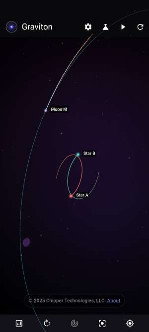

# 📱 Complete Screenshot Gallery

*Click any screenshot to view full size*

This page contains the complete collection of screenshots from the Graviton gravitational physics simulator, organized by platform. Each screenshot corresponds to a specific preset scene designed to showcase different aspects of the simulation.

| Scene Name | Android | iOS |
|------------|---------|-----|
| **Galaxy Formation Overview** |  |  |
| **Galaxy Core Detail** |  |  |
| **Galaxy Black Hole** |  |  |
| **Complete Solar System** |  |  |
| **Inner Solar System** |  |  |
| **Earth View** |  |  |
| **Saturn's Majestic Rings** |  |  |
| **Earth-Moon System** |  |  |
| **Binary Star Drama** |  |  |
| **Binary Star Planet & Moon** |  |  |
| **Asteroid Belt Chaos** |  |  |
| **Three-Body Ballet** |  |  |

---

## 🎬 About the Presets

Each screenshot corresponds to a carefully crafted preset scene in the app's **Screenshot Mode** (available in development builds). These presets showcase:

### 🌌 Galaxy Formation Scenes (1-3)
- Massive particle simulations showing galactic structure formation
- Black hole dynamics and stellar cluster evolution
- Cosmic-scale gravitational interactions

### 🪐 Solar System Scenes (4-7)  
- Complete solar system with all planets and moons
- Inner planetary system with habitable zone indicators
- Detailed Earth and Saturn ring system views

### 🌍 Multi-Body Dynamics (8-12)
- Earth-Moon-Sun three-body system
- Binary star systems with planetary companions
- Asteroid belt chaos and three-body ballet formations

Each preset includes optimized camera positioning, trail settings, and timing to capture the most dramatic and educational moments of the gravitational physics simulation.

---

**[← Back to Main README](../README.md)**